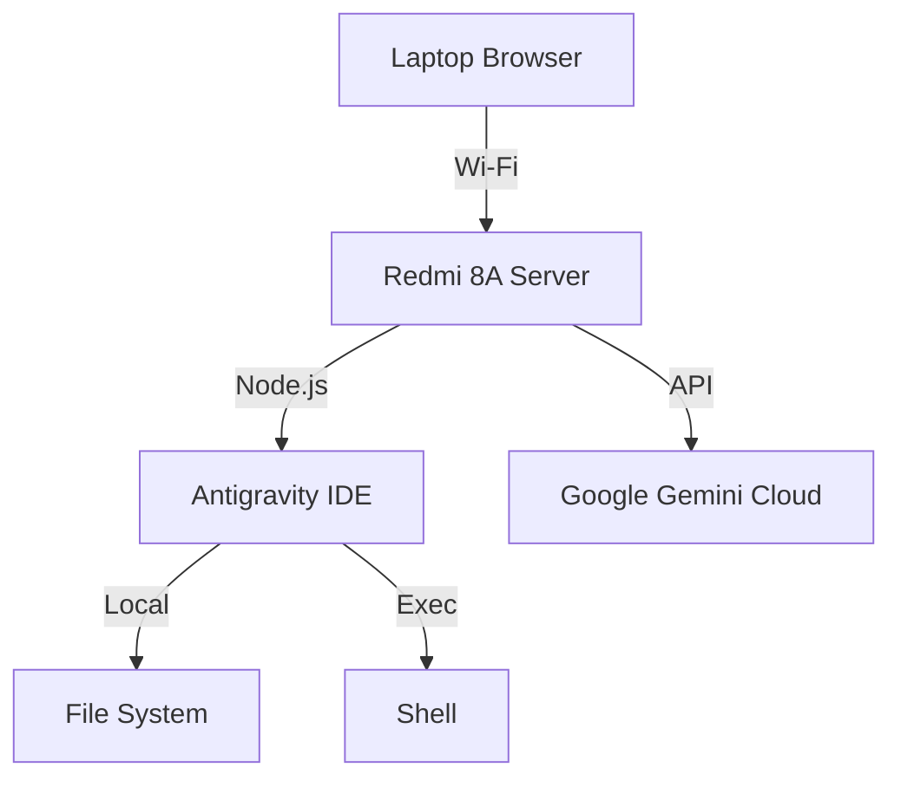

# 🌌 Antigravity: The $0 Edge AI Server

> **"Turn your old Android phone into a production-grade AI Cloud IDE."**


-orange)


**Antigravity** is a lightweight, full-stack IDE and Agentic Server designed to run on extreme edge hardware (2GB RAM Android devices). It uses **Termux** as the hostOS and Google's **Gemini 1.5 Flash** as the Neural Core, effectively offloading intelligence to the cloud while keeping the runtime local.

## ⚡ Features

-   **📱 Edge-Native:** Runs on unmodified Android phones (via Termux).
-   **🧠 Neural Core:** Zero-RAM AI integration (Gemini 1.5 Flash) for code generation and chat.
-   **💻 Cloud IDE:** Full Monaco Editor + Terminal accessible via Wi-Fi (`localhost:3000`).
-   **💾 Time Capsule:** Auto-saving sessions and Git integration.
-   **🔧 Wireless:** Deploy code via ADB, then cut the cord.

## 🚀 Quick Start (Installation)

### Prerequisites
1.  An Android Phone (Android 10+ recommended).
2.  [Termux App](https://f-droid.org/en/packages/com.termux/).
3.  A Laptop (for initial setup).

### Step 1: The "Wake Up" Call
Connect your phone via USB and run the setup script (or manually push files):

```bash
# Clone this repo
git clone https://github.com/yourusername/antigravity-edge.git
cd antigravity-edge

# Install dependencies on Phone (Termux)
pkg install nodejs git -y
npm install
```

### Step 2: Ignite the Core
In Termux:
```bash
node server.js
```

### Step 3: Neural Link
Open your laptop browser and visit your phone's IP:
`http://192.168.x.x:3000`

## 🛠️ Architecture



## 📸 Screenshots

| Wireless IDE | AI Agent |
| :---: | :---: |


## 🤝 Contributing
Built for the **Edge Computing** community. PRs welcome for optimizing memory usage further!

## 📜 License
MIT © 2026 Shashank 
